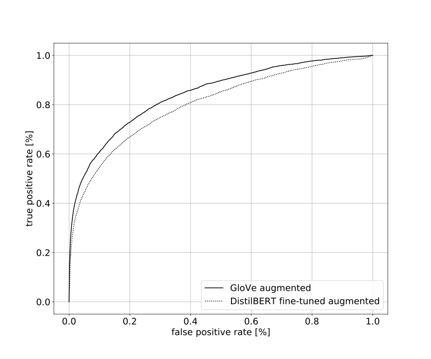

# Using Transformer-based Deep Learning Methods to address theConstruct Identity Problem in Information Systems Research andLiterature Reviews

*Masterthesis by Fabian Längle*
 

In the field of behavioral research, it is often difficult for researchers to gain a holistic view of the entire relevant work and thus to detect whether or not two constructs refer to the identical real-world problem. Building upon prior work, we implement and compare recently published, transformer-based models like BERT, RoBERTa, DistilBERT and ALBERT to the Construct Identity Problem (CIP) and leverage the potential of contextual data augmentation. Although deeply bidirectional representations do not improve existing results, we approve a significantly positive effect of fine-tuning a language model to a domain-specific corpus. Through contextualized data augmentation, we are able to improve the state-of-the-art GloVe-based solution. In total, this work presents a new and promising artifact to address the Construct Identity Problem.

Our best performing transformer-based model is DistilBERT, the overall best performing model is GloVe with AUC-scores of **80.30** and **84.45**, respectively. Both were either fine-tuned or trained on contextually augmented construct items. Both resulting AUC ROC curves are shown in the plot below.

